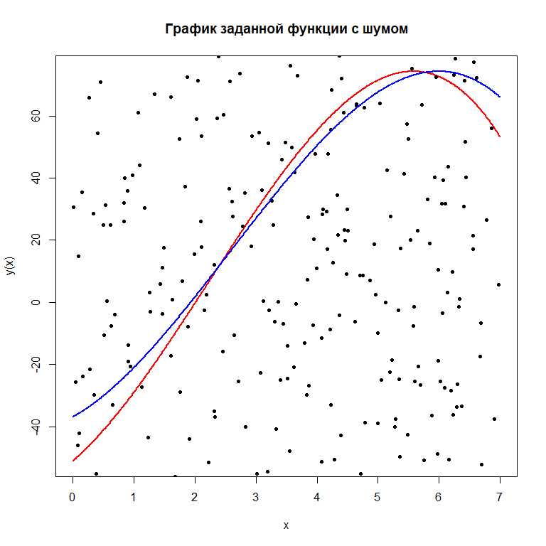
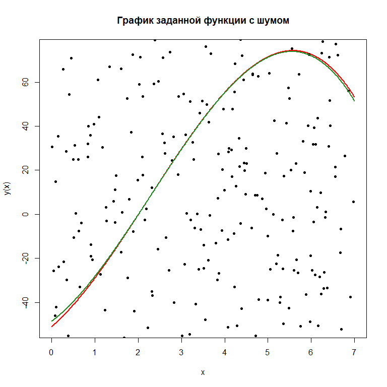

# Регрессия

Регрессия - задача восстановления зависимости между наблюдаемыми характеристиками объекта. Задача регрессии - построить аналитическую зависимость, которая максимально близко бы описывала некоторую наблюдаемую закономерность.

Задача регрессии имеет решение в аналитическом виде, и в виде задачи минимизации.

\[
{||X*\overline{a} - \overline{y}||}_{2}^{2} \rightarrow min_{x_{i,j} \in D}
\]

\[
{||\overline{z}||}_{2}^{2} = \sum_{i = 1}^{n} (z_{i})^{2}
\]

\[
\overline{a} = (X^TX)^{-1}X^{T}\overline{y}
\]

# Метод многократных статистических испытаний (метод Монте-Карло)

Пусть $\overline{a^k}$ - некий k-ый вектор параметров исходной зависимости, который получен при очередной генерации случайного шума. Тогда $A = \{\overline{a^1}, \overline{a^2}, \dots, \overline{a^m}\}$ - матрица составленная из векторов параметров, полученных в ходе повторных статистических испытаний. 


```r
# Задание параметров эксперимента -----------------------------------------
x <- seq(0, 7, 0.01)
len_var <- length(x)
n <- 3
a <- c(-51, 17, 6, -0.9)
sd_coeff <- 160
mean_coeff <- 0
iterations <- 1000
```


```r
# Задание матрицы входов и выходов ----------------------------------------
y_func <- function(n, x, a, noise) {
    # Здесь ваш код
    return(list(X = NULL, y = NULL))
}
```


```r
regression_model <- function(X, y) {
    # Ваш код здесь
}
```


```r
get_output <- function(x, a) {
    # Ваш код здесь
}
```


```r
Monte_Carlo_method <- function(n, x, a, mean_coeff, sd_coeff, iterations) {
    # Ваш код здесь
}
```


```r
data <- y_func(n = n, x = x, a = a, noise = rnorm(len_var, mean_coeff, sd_coeff))
y <- get_output(x, a)

a_regr <- regression_model(data[[1]], data[[2]])
y_regr <- get_output(x, a_regr)

a_monte <- Monte_Carlo_method(n, x, a, mean_coeff, sd_coeff, iterations)
y_monte <- get_output(x, a_monte)

print(a - a_regr)
```

```
## [1] -14.1240794   5.9418639   0.4004239  -0.1743439
```

```r
print(a - a_monte)
```

```
## [1] -2.42000139  2.09443177 -0.56200161  0.04983257
```


```r
# отрисовка графика, полученного в результате моделирования с шумом -------
plot(x = x, y = y, 
     type = "l", lwd = 2, col = "red",
     main = "График заданной функции с шумом",
     ylab = "y(x)", xlab = "x")
points(x = x, y = data[[2]], 
       type = "p", cex = 1, 
       pch = 20, col = "black")
lines(y = y_regr, x = x, 
      col = "blue", lwd = 2)
```

<!-- -->


```r
plot(x = x, y = y, 
     type = "l", lwd = 2, col = "red",
     main = "График заданной функции с шумом",
     ylab = "y(x)", xlab = "x")
points(x = x, y = data[[2]], 
       type = "p", cex = 1, 
       pch = 20, col = "black")
lines(y = y_monte, x = x, 
      col = "forestgreen", 
      lwd = 2)
```

<!-- -->

